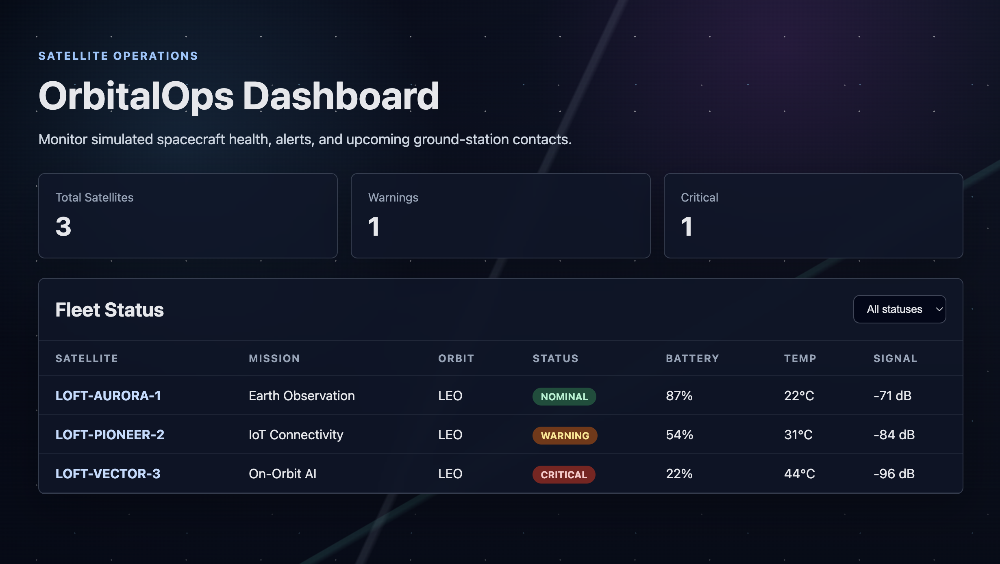

## OrbitalOps Dashboard

OrbitalOps Dashboard is a Vue + TypeScript satellite operations dashboard for monitoring simulated spacecraft health, alerts, telemetry, and ground-station contact windows.

This project was built to practice and demonstrate frontend engineering skills relevant to operational web applications, including SPA routing, GraphQL API integration, data-heavy UI components, and automated testing.



## Features

- Satellite fleet dashboard with current status (normal, warning, or critical) metrics
- Status filtering
- Satellite detail pages with telemetry, alerts, and contact windows
- GraphQL API served locally with GraphQL Yoga
- Apollo Client integration on the Vue frontend
- Vue Router-based SPA navigation
- Unit/component tests with Vitest
- E2E browser tests with Playwright
- TypeScript, ESLint, and Prettier for maintainability

## Tech Stack

Vue.js, Vue Router, Typescript, GraphQL, Apollo Client, GraphQL

TypeScript cannot handle type information for `.vue` imports by default, so we replace the `tsc` CLI with `vue-tsc` for type checking. In editors, we need [Volar](https://marketplace.visualstudio.com/items?itemName=Vue.volar) to make the TypeScript language service aware of `.vue` types.

## Running Locally

See [Vite Configuration Reference](https://vite.dev/config/).

Install Dependencies

```sh
npm install
```

Run the project- this will run both the client and the server.
The Vue frontend runs at: http://localhost:5173
The GraphQL server runs at: http://localhost:4000/graphql

```sh
npm run dev:all
```

To run the frontend only (use this only if the GraphQL server is already running separately):

```sh
npm run dev
```

To run the backend only:

```sh
npm run server
```

### Example GraphQL query

```graphql
query {
  satellites {
    id
    name
    status
    batteryPercent
    temperatureC
    signalStrengthDb
  }
}
```

### Running tests

Running E2E tests

```sh
npm run test:e2e
```

Running Unit Tests

```sh
npx playwright test --ui
```

You may need this installed:

```sh
npx playwright install
```

# Recommended commands before committing changes

```sh
npm run test:unit
npm run test:e2e
npm run type-check
npm run lint
npm run build
```
